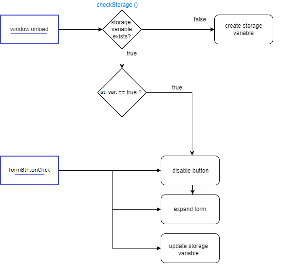

# Name

MJ construcciones

## Purpose

This portfolio serves as a comprehensive tool to showcase the trajectory and capabilities of this construction company, thereby enhancing its professional credibility and ultimately bolstering its client acquisition efforts.

## Link

mjconstrucciones.ar

## Project status

Finished

## Contact 

https://www.linkedin.com/in/matias-ramos-computacion/

## Code 

### Languages

- HTML
- SCSS (css)
- JS vanilla

### Frameworks

Bootstrap 4.6

### Animations

AOS: https://michalsnik.github.io/aos/

### Directory tree

### Code explanation

Most of the code is quite self explanatory, but if there are some files that need to be explained those would be the .js files that handles the forms (llaveEnManoForm.js, piletasForm.js, remodelacionesForm.js).

They do basically the same, which are two things: Insert the form in the DOM, and update a local storage variable. The purpose of the local storage variable is keep the form open if the button to open the form was clicked but the browser was reload.

The reason for this implementation is to encourage the user to finish the transaction if he already started it.

## Deployment

### Pre-requisites
- VScode (or any other IDE of preference)
- Git
- NodeJS

### Installation for development

How to install the project and its dependencies: 

1. git clone https://github.com/Matias-Ramos/MJ-Construcciones.git
2. cd root
3. npm install
4. npm run watch-css
5. open index.html and code to see the changes.

## Last comments
My apologies for the spanglish on the name of some variables, it is a practice I don't carry with me anymore. This was my first web project and the cost-benefit of fixing it now is just not worth it, so I decided to leave it as is. 